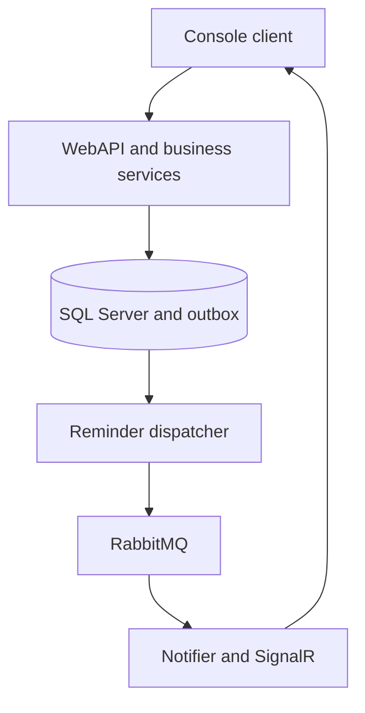

# TaskManager

[](https://github.com/serhiiyasenev/TaskManager/actions/workflows/run-tests.yml)

A .NET application for managing teams, projects and assigned tasks, with due-date reminders and live notifications. It demonstrates how a business API, a relational database and an asynchronous notification service work together.

**Project status:** a portfolio application with an API, console client, notification host and automated tests. It is suitable for demonstrating backend behavior and architectural choices; production scale, availability and security are not established by this repository.

## What you can demonstrate

| Scenario | What to show |
|---|---|
| Manage work | Create/read/update teams, projects and tasks; assign an existing user to a task |
| Inspect progress | Query project/task/team/user reports through the analytics API or console menu |
| Follow deadlines | Configure a reminder and an overdue escalation for an active task |
| Recover interrupted delivery | Keep reminder envelopes in SQL Server until confirmed publication; retry with the same message ID |
| Receive live updates | Consume RabbitMQ events in Notifier and display them through SignalR in the console |
| Exercise identity | Register/log in with ASP.NET Core Identity and JWT; demonstrate the specifically protected endpoints |

Email for reminder events is simulated in logs. Notifications are broadcast to connected clients; there is no per-user notification inbox.

## Run locally

Prerequisites: .NET 10 SDK, Docker with Compose (or separately running SQL Server and RabbitMQ), and a trusted HTTPS development certificate. The configuration example uses Bash and OpenSSL. Run all commands from the repository root.

```bash
git clone https://github.com/serhiiyasenev/TaskManager.git
cd TaskManager

# Start infrastructure only. The full compose application definition is older.
docker compose up -d mssql rabbitmq
docker compose ps

dotnet restore TaskManager.sln
dotnet dev-certs https --trust

# This password is the LOCAL DEMO value declared in docker-compose.yml.
export ConnectionStrings__DbConnection='Server=localhost,1433;Database=TaskManagerDB;User Id=sa;Password=Your_strong_password_123!;TrustServerCertificate=True'
export Jwt__Key="$(openssl rand -hex 32)"
export Reminders__PollIntervalMinutes=1

# Install once; use the local EF tool for this solution.
dotnet tool install --tool-path ./.tools dotnet-ef --version 10.0.6
./.tools/dotnet-ef database update --project DAL --startup-project WebAPI

dotnet run --project WebAPI --launch-profile WebAPI
```

Wait for the database container to be ready before applying migrations. If you use an existing database, read the [outbox rollout instructions](docs/reminder-delivery.md) first. The application does not automatically apply migrations.

In a second terminal:

```bash
dotnet run --project Notifier --launch-profile https
```

In a third terminal:

```bash
dotnet run --project Client
```

| Entry point | Local address |
|---|---|
| API documentation | [https://localhost:7151/swagger](https://localhost:7151/swagger) |
| SQL Server health check | [https://localhost:7151/health](https://localhost:7151/health) |
| SignalR hub | `https://localhost:7268/chathub` |
| RabbitMQ management | [http://localhost:15672](http://localhost:15672), local demo credentials `guest` / `guest` |

The console currently uses these API/hub URLs directly. Use the launch profiles above; changing ports requires updating the console configuration in code. RabbitMQ host, port, credentials and queue names must agree between `WebAPI` and `Notifier`. Defaults are local `TestQueue` and `TaskReminders` queues.

Admin bootstrap is disabled by default. To exercise admin-only operations, explicitly configure `BootstrapAdmin__Enabled`, `BootstrapAdmin__Email` and `BootstrapAdmin__Password` in your local environment and restart the API. There is no published default admin login. Registration/login alone does not make a user an administrator.

## Five-minute deadline demo

1. Open Swagger or select console option **11** to list tasks. Choose an active task (`ToDo` or `InProgress`) and note its ID. Migrations seed example teams, users, projects and tasks.
2. Select console option **12**. Enter that task ID, a due date **two minutes ahead in UTC** (ISO 8601 with `Z`), enable the reminder with offset **1** minute, and enable escalation with delay **1** minute. The equivalent API is `PUT /api/Tasks/{id}/reminder`.
3. Keep Notifier and the console running. With the one-minute polling interval above, observe the reminder near the deadline and an overdue notification after it. Polling is periodic, so delivery time is approximate.
4. Select **11** again to inspect `ReminderSentAt`/`EscalationSentAt`. These mark confirmed publication to RabbitMQ, not receipt by an end user.
5. Show an analytics query in Swagger and explain how it relates the task to its project and performer.

For a recovery demo, stop the local RabbitMQ service, configure a new due occurrence, and inspect the pending `NotificationOutbox` row and logs. Restart RabbitMQ and observe retry after backoff/lease expiry. Allow up to five minutes after an interrupted dispatch. Reset the due date when repeating the demo so a new occurrence is created. Use an isolated local environment for this exercise.

## Architecture and tradeoffs


```mermaid
flowchart TD
    Client[Console client] --> API[WebAPI and business services]
    API --> DB[(SQL Server and outbox)]
    DB --> Dispatcher[Reminder dispatcher]
    Dispatcher --> Rabbit[RabbitMQ]
    Rabbit --> Notifier[Notifier and SignalR]
    Notifier --> Client
```

| Component | Responsibility | Design reason and tradeoff |
|---|---|---|
| `WebAPI` | REST endpoints, authentication setup, health endpoints and scheduler | A single API host keeps deployment understandable; scheduler lifecycle follows the API |
| `BLL` | Domain services, validation, mapping, analytics and queue publishing | Business rules can be tested independently of HTTP; adds mapping and service abstractions |
| `DAL` | EF Core, Identity data, repositories, migrations and reminder outbox | SQL Server owns durable state; migrations and concurrency rules must be maintained |
| `Notifier` | RabbitMQ consumption and SignalR broadcasts | Delivery is decoupled from request handling; requires a running broker and another host |
| `Client` | Console navigation and live message listener | Makes API scenarios easy to demonstrate; it is not a production web interface |
| `Tests` | Unit, application and persistence regression tests | Fast feedback plus targeted relational checks; not a substitute for load/failover testing |

Reminders use a transactional outbox to close the gap between storing task state and sending a message. Claims and publisher confirms support recovery across failures. Delivery remains **at least once**: a crash after sending but before recording success can repeat the same message ID. Read [delivery guarantees, deployment and recovery](docs/reminder-delivery.md).

## Tests and maintenance

```bash
dotnet build TaskManager.sln --configuration Release
dotnet test TaskManager.sln --settings .runsettings --configuration Release
```

Tests use xUnit and Moq. Most existing persistence tests use EF Core InMemory; outbox concurrency/rollback tests use SQLite. Publisher and SignalR acknowledgment tests use mocked transport boundaries. CI also rejects dependencies with known vulnerability advisories. See [the workflow](.github/workflows/run-tests.yml) for the current build, test and coverage steps.

[Developer commands](CLAUDE.md) and [repository process notes](AI/README.md) are separate from the application feature set.

## Known limitations

- Full `docker compose up` is not the documented launch path: application service images still target .NET 9 and some compose URLs do not match the console. Use Compose for `mssql`/`rabbitmq` and the .NET 10 launch profiles above.
- Authorization covers selected endpoints; tenant isolation and a complete endpoint access review are not implemented.
- SignalR broadcasts to all connected clients; there is no durable per-user inbox or offline delivery. Reminder email is simulated.
- At-least-once delivery can produce repeated notifications around crash boundaries. Durable consumer deduplication and bounded poison-message retries/DLX remain follow-up work.
- Published/canceled outbox rows need a retention policy. Multi-instance deployments require synchronized clocks and further operational testing.
- Serilog includes a local Loki sink (`localhost:3100`); Loki/Grafana are optional and are not provisioned by the documented infrastructure command.
- `/health/ready` currently selects a tag with no registered checks; use `/health` when demonstrating database health.
- No production throughput, delivery SLA or business impact metrics have been measured here.
