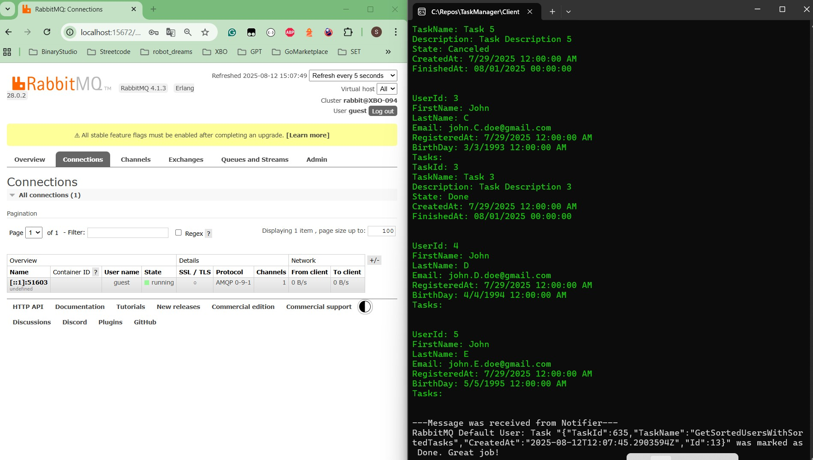

# 📝 TaskManager

**TaskManager** is a multi-component project management and task tracking system built with **.NET 9**, **SignalR**, **RabbitMQ**, **Serilog**, and a layered architecture (**BLL**, **DAL**, **WebAPI**, **Client**, **Notifier**).  
The system supports **real-time notifications**, **asynchronous task processing**, **analytics**, and **modular expansion**.

---

## 🚀 Main Features
- **Project and Task Management**
  - Provide Analytics about projects: analyze tasks, examine team structure, investigate projects, measure user performance, compare teams and participants
  - Create, update, and delete projects, tasks, users, and teams
  - Link tasks to projects and users
  - Auth
- **SignalR Integration**
  - Instant real-time messages between the server and clients
- **RabbitMQ Messaging**
  - Asynchronous communication between services
- **Layered Architecture**
  - **BLL** (Business Logic Layer)
  - **DAL** (Data Access Layer)
  - **WebAPI** (REST API)
  - **Client** (Console client application)
  - **Notifier** (Notification service)
- **Scalability**
  - Can be deployed locally, in Docker or in any cloud provider
  - Supports SQL Server or you can switch to your DB provider

---

## 🛠 Technology Stack
- **.NET 9**
- **C#**
- **Entity Framework Core**
- **SignalR**
- **RabbitMQ**
- **SQL Server**
- **Serilog**
- **Docker** (optional)

---

## 📦 Sequence Diagram


## 📦 Project Structure


⚙️ Local Setup Instructions

Install SQL Server and RabbitMQ (or run them via Docker)

Configure connection strings in appsettings.json for WebAPI and Notifier

Run the following commands in the projects root:

```bash
dotnet run --project WebAPI
dotnet run --project Notifier
dotnet run --project Client
```

Use the console client to interact with the system

Also, you can use Swagger, Postman or any other client to execute Web API requests 

0. Get Tasks Count In Projects By User Id
1. Get Capital Tasks By User Id
2. Get Projects By Team Size
3. Get Sorted Team By Members With Year
4. Get Sorted Users With Sorted Tasks
5. Get User Info
6. Get Projects Info
7. Get Sorted Filtered Page Of Projects
8. Get Tasks Status By Project User Id
9. Start Timer Service To Execute Random Tasks With a Delay
10. Stop Timer Service
11. Exit the program





---
## 🛢️ Database Diagram


